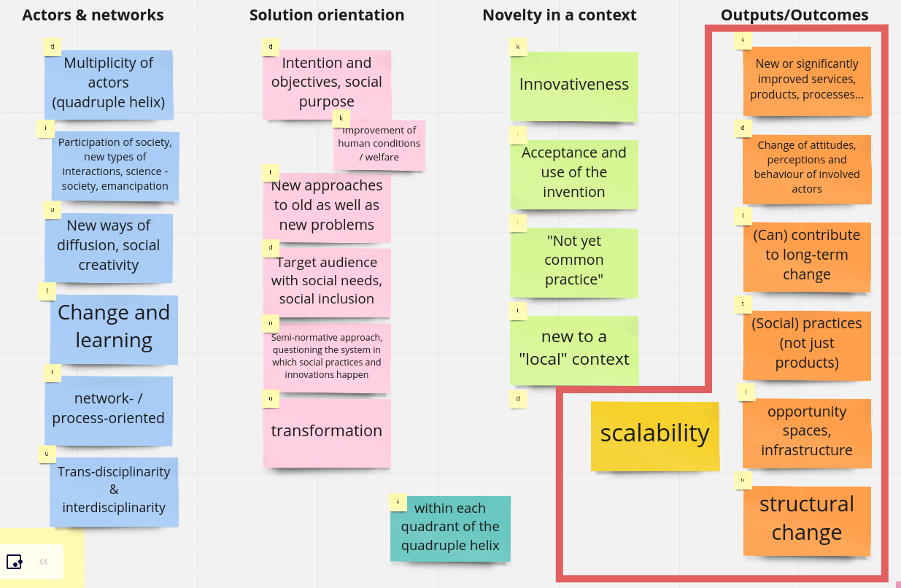

<style>

.center2 {
  margin: 0;
  position: absolute;
  top: 50%;
  left: 50%;
  -ms-transform: translate(-50%, -50%);
  transform: translate(-50%, -50%);
}

.large { font-size: 130% }
.small { font-size: 70% }

</style>


```{r setup, include = FALSE}
library(tufte)
# invalidate cache when the tufte version changes
knitr::opts_chunk$set(
	message = FALSE,
	warning = FALSE,
	cache.extra = packageVersion("tufte")
)
options(htmltools.dir.version = FALSE)
library(dplyr)
library(ggplot2)
library(ggbeeswarm)
library(plotly)
library(magrittr)
library(ggplot2)
library(PerformanceAnalytics)
library(psych)
library(corrplot)
library(nFactors)
library(kableExtra)
require(ggiraph)
require(ggiraphExtra)
require(plyr)
library(sjPlot)
library(sjmisc)
library(sjlabelled)
library(tidyverse)
library(gt)
library(grid)
library(ggpubr)
library(psych)
library(GPArotation)
library(car)
library(candisc)
library(jtools)

setwd("/home/ubd/Nextcloud/utku_SIVOCS")
# Data Frame
source("./02_analysis/02_static_responses.R")
# colnames of the specific question groups
source("./02_analysis/99_question_groups.R")
# A good table to display factor analysis
source("https://raw.githubusercontent.com/franciscowilhelm/r-collection/master/fa_table.R")
```


# Distribution of sci. disciplines by gender
```{r echo=FALSE, fig.width=16}
ggplotly(
ggplot(data, aes(domain, fill=gender)) +
  geom_bar() +
  theme_minimal() 
#+
 # theme(axis.text.x = element_text(angle = 45, vjust = 0.5, hjust=1)) 
)

```


---
class:center2
# E1/E2 | Hypothesis 1

**H1**: Although not a necessity for SI, **trans-/interdisciplinary approaches** are often associated with socially innovative projects. We are expecting a tendency toward trans-/interdisciplinary approaches from researchers who have **more knowledge on SI** and increased involvement of trans-/interdisciplinarity with the higher self SI-level assessment in the project.
  * **H1_a**: Higher the knowledge about SI, further the involvement of other disciplines.
  * **H1_b**: Higher the knowledge about SI, higher the transdisciplinarity involvement.

-> E1 and E1 compiled into a single variable E1/2

---
# E1/2 | Variables & Inner Correlation

```{r echo=FALSE, fig.width=16}
corr_matrix_plt(e12.df, colcol="#A8CCF6")

```

---

# E1/2 | **H1_a**: Interdisc. vs SI knowledge


```{r echo=FALSE, fig.width=16}
e1b1.df <- as.data.frame(cbind(e1.res. = e12.df$inv.other.disciplines,
                                b1.familiarWithSI = data$familiarWithSI.response.))

e1b1.cor <- cor.test(e1b1.df$e1.res, e1b1.df$b1.familiarWithSI,  method="spearman")

lm_scatter(e1b1.df, x = e1b1.df$b1.familiarWithSI, y = e1b1.df$e1.res.,     laby="Involv. of researchers from other disciplines", labx = "SI knowledge") 

```

* Neglible, positive & significant correlation


---
# E1/2 | LM: IDV: Familiarity with SI, DV: Interdisciplinarity

```{r echo=FALSE}
e1b1.df$contribToSI.rate. <- data$contribToSI.rate.
e1b1.model <- lm(data = e1b1.df, e1.res. ~ b1.familiarWithSI 
                 #+ contribToSI.rate. p
#e1b1.model <- lm(data = e1b1.df, contribToSI.rate.~ e1.res.
                  )
summ(e1b1.model)


```
---
# E1/2 | **H1_a**: Interdisc. vs SI self assesment

```{r echo=FALSE, fig.width=16}
e1b1.df <- as.data.frame(cbind(e1.res. = e12.df$inv.other.disciplines,
                                b1.familiarWithSI = data$familiarWithSI.response.,
                               c2.contribToSI = data$contribToSI.rate.))


lm_scatter(e1b1.df, x = e1b1.df$c2.contribToSI, y = e1b1.df$e1.res.,     laby="Involv. of researchers from other disciplines", labx = "Contribution to SI") 

```

---

# E1/2 | **H1.b**: [...] further the transdisciplinary involvement.

DV: Composite variable created with all the other sub-variables than interdisciplinarity

```{r echo=FALSE, fig.width=16}
e12b1_trans.df <- as.data.frame(cbind(e12.trans = e12.trans_df$inv.trans,
                                b1.familiarWithSI = data$familiarWithSI.response.))

e12b1_trans.cor <- cor.test(e12b1_trans.df$e12.trans, e12b1_trans.df$b1.familiarWithSI,  method="spearman")

lm_scatter(df=e12b1_trans.df, x= e12b1_trans.df$b1.familiarWithSI, y=e12b1_trans.df$e12.trans, laby="Involvement of transdisciplinary actors", labx = "SI knowledge", posx=0, posy=9)

```

* Low positive correlation


---

# E1/2 | H1.b 

```{r echo=FALSE}
e12b1_trans.df$contribToSI.rate. <- data$contribToSI.rate.
e12b1_trans.model <- lm(data = e12b1_trans.df , e12.trans  ~ b1.familiarWithSI
#e1b1.model <- lm(data = e1b1.df, contribToSI.rate.~ e1.res.
                  )
summ(e12b1_trans.model )


```

---


```{r echo=FALSE, fig.width=16}
e12b1_trans.df <- as.data.frame(cbind(e12.trans = e12.trans_df$inv.trans,
                                b1.familiarWithSI = data$familiarWithSI.response.,
                                c2.contribToSI = data$contribToSI.rate.))


lm_scatter(df=e12b1_trans.df, x= e12b1_trans.df$c2.contribToSI, y=e12b1_trans.df$e12.trans, laby="Involvement of transdisciplinary actors", labx = "SI self assessment", posx=0, posy=9)

```

---

# E1/2 | Manova Test

```{r}
e12b1_trans.df$e12.inter <- e12.df$inv.other.disciplines
summary.aov(manova(data = e12b1_trans.df,  cbind(e12.inter, e12.trans) ~ b1.familiarWithSI))

```

---

class:clear

Both inter- and transdisciplinary aspect are stat. significantly increasing with higher rates of SI knowledge, however,
the tendency to interdisciplinarity is considerably lower than transdisciplinary involvement.

---
class:center2
# E1/2, H2 | Variables

H3: **Transdisciplinary approaches** are often applied to capitalize on the ability of multiplicity of non-academic actors to **address a specific issue**. Therefore; it is expected for a trans-/interdisciplinary project to,  

* H3a: explore issues previously **not (widely) known in society or academia**, and secondly,
* H3b: be more inclined toward addressing **a specific social issue or improving the human condition**,
* H3c: also aim to design/offer an up-/out-/deep-**scalable solution**.

*Variables addressed by the Hypothesis:* 

* **G6**: [...] impact statements apply to your project?
* **H2**: [...] long term the scalability [...]

---
# E1/2 | G6: Impact statement

* The targeted, non-academic groups have – either through participation or through the focus of project – likely gained capabilities to better tackle similar existing or upcoming issues.
	
* The project’s actions played an emancipatory role for the targeted groups.

* The project generated a deeper/better understanding of a specific social issue.
	
* The project contributed to the mitigation of a social issue.
	
* The project results addressed an issue that was not (widely) known in the society before.
	
* The scrutinised issue was not (widely) addressed in academia before. 

---
# E1/2, H2a/b | Inner correlations of G6

```{r echo=FALSE, fig.width=16}
corr_matrix_plt(g6.df)
```

---
class:clear

```{r echo=FALSE}
g.ev <- eigen(cor(na.omit(g.df))) 
g.ns <- nScree(x = g.ev$values)
g.fit <- fa(na.omit(g.df), as.vector(g.ns$Components)[["nkaiser"]], rotate = "varimax")

tab_fa(g.fit)

```

---

# E1/2, H2a/b | Distribution of the composite G6 (Impact Statement) 

```{r echo=FALSE, fig.width=16}
g6.composite <- as.data.frame(table(g6.weighted_df$composite.10.R))
ggplot(data=g6.composite, aes(x=Var1, y=Freq)) +
  geom_bar(stat="identity", fill="steelblue") + 
  theme(axis.text.x = element_text(angle = 45, vjust = 0.5, hjust=1)) +
  xlab("Impact Statement")
```

---
# E1/2, H2a/b | Correlations with G6 (Impact Statement)

```{r echo=FALSE, fig.width=16}
corr_matrix_plt( cbind(e12.trans_df, g6.composite = g6.weighted_df$composite.10.R))
```

---
# E1/2, H2a/b | LM Impact Statement ~ Inter/Transdisc. involvements

```{r echo=FALSE}
e1g6.df <- cbind(e12.trans_df,
                 g6.composite = g6.weighted_df$composite.10.R)
e1g6.model <- lm(data = e1g6.df, g6.composite ~ inv.other.disciplines + inv.trans + inv.other.disciplines:inv.trans 
                  )
summ(e1g6.model)

```


---

# E1/2, H_2a/b | Trans. involvement vs. Impact statement

```{r echo=FALSE, fig.width=16}

e1g6.df <- as.data.frame(cbind(e12.trans = e12.trans_df$inv.trans ,
                                g6.composite = g6.weighted_df$composite.10.R))

lm_scatter(df=e1g6.df, x=e1g6.df$e12.trans, e1g6.df$g6.composite,  labx="Transdisciplinary Involvement",
    laby = "Impact Statement")  

```

---

# E1/2, H_2c | Corr. with scaleability variables

```{r echo=FALSE, fig.width=16}
corr_matrix_plt(cbind(e12.trans_df, h2.df))
```


---

# E1/2, H_2c | LM Scaleability ~ Inter/Transdisc. involvements

```{r echo=FALSE}
e1h2.df <- cbind(e12.trans_df,
                 h2.scaleability.composite = (h2.df$scalabilityRating.deep. + h2.df$scalabilityRating.up. + h2.df$scalabilityRating.out.)/3)
e1h2.model <- lm(data = e1h2.df, h2.scaleability.composite ~ inv.other.disciplines + inv.trans
                  )
summ(e1h2.model)

```


^[Scalebility variables compiled into a composite variable]

---

# E1/2, H_2c | Trans. Inv. vs Scaleability by sci. domains 


```{r echo=FALSE, fig.width=16}
e1h2.df$domain <- data$domain
ggplotly(
ggplot(e1h2.df, 
       aes(x = inv.trans, y = h2.scaleability.composite, color=domain)) + 
  geom_point() + 
  ggtitle("") + 
  geom_smooth(method=lm, se=TRUE, fullrange=TRUE)+
  #geom_jitter(color='#377eb8')+
  geom_jitter()+
  theme_minimal() +
  scale_x_discrete(breaks = seq(1,20,1)) + 
#  geom_point(color='#377eb8') +
 labs(
    x="Transdisciplinary Involvement",
    y = "Scaleability") 
  ##stat_cor( output.type = "text", method = "spearman") +
  ##stat_regline_equation(output.type = "text")
)

```

---
class:clear
## B1: How familiar are you with the concept of “social innovation”

--

**H**: The familiarity with the concept of SI depends on the field of research. The one one is familiar with the concept of SI, the higher is the propensity to contribute to SI.

Further correlation assumptions:

* A1: experience with transdisciplinarity


---
# B1 | ANOVA test: SI familiarity depends on sci. domains?

.small[ Caution, we are assuming familiarity with SI has an interval scale and variance homogenity]

```{r echo=FALSE}
b1domain.df <-data.frame(familiarWithSI = data$familiarWithSI.response.,
                         domain =  data$domain)

b1.aov <- aov(data=b1domain.df, familiarWithSI ~ domain)

summary(b1.aov)

```
```{r}
broom::tidy(pairwise.t.test(b1domain.df$familiarWithSI,  b1domain.df$domain))
```

---

# Distribution of familiarity with SI among sci. domains

```{r echo=FALSE, fig.width=16}

b1domain.df %>% 
  gather(key="domain", value="familiarWithSI") %>%
  ggplot( aes(x=familiarWithSI, y=domain, fill=domain),  show.legend = FALSE) +
    geom_boxplot() +
  ylab(" ")+
  theme(axis.text.y=element_blank())

```

---
class:clear

* There is a stat. significant difference between sci. domains in terms of familiarity with SI.

* We can't stat. argue about any differences between Natural Sciences and Biology & Medicine,

* however, the difference between SSH and other domains is stat. significant.

---

# B1 | Correlation with A1

```{r echo=FALSE, fig.width=16}
b1domain.df$trans_exp <- data$transdisciplinaryExp.rate.


lm_scatter(b1domain.df, x= b1domain.df$trans_exp, y=b1domain.df$familiarWithSI, posx=0, posy=9,
           labx="Transdisciplinary experience", laby="Familiarity with SI")


```

---
## A

---
# A1 
**H**: Transdisciplinarity is usually an important cornerstone for social innovation, although it is no condition for it. Moreover, not all transdisciplinary research automatically contributes to social innovation. Nevertheless, we assume that a higher experience in transdisciplinary research might point to a higher propensity for social innovation.

---

# A1 

```{r echo=FALSE, fig.width=16}
corr_matrix_plt(cbind(trans_exp = data$transdisciplinaryExp.rate., e12.trans_df, d1.df))
```

---
# A2 
**H**: The younger the researcher the more is s/he inclined to work transdisciplinarily and the more s/he shows a higher propensity for social innovation.

No correlation is significant
```{r echo=FALSE, fig.width=16}
corr_matrix_plt(cbind(academicAge = data$academicAgeNum, e12.trans_df, trans.aspects = e3.df, trans.exp = data$transdisciplinaryExp.rate.))
```


---
class:clear
## D1 

---


# D1 | Distribution/ Inner correlation


```{r echo=FALSE, fig.width=16}
corr_matrix_plt(d1.df)
```

---
# D1 | Hypothesis

**H**: : The **motivation to directly address a natural, technical economic or social problem** or even **to improve the human condition/welfare** can be a strong component for **social innovation**, although it is not a pre-condition. **The motivation to better understand a natural, technical, economic or social phenomenon**, however, points to a rather “regular” scientific motivation, **without directly aiming to problem solving** or improving human/welfare conditions.

Correlation assumptions:
* Academic fields
* F3: [...] aim at supporting evidence-based decision-making of policy-makers
* C2: [...] SI contribution
* **SI composite indicator**
 

---
# D1 | correlation with F3 

```{r echo=FALSE, fig.width=16}

corr_matrix_plt(as.data.frame(cbind(d1.df, evbased_decis.policym. = f3.df)))

```

---

# D1 | correlation with G1 & G6 

```{r echo=FALSE, fig.width=16}
corr_matrix_plt(as.data.frame(cbind(d1.df
, g1.modf.3, g6.Impactstatements.comp. = g6.weighted_df$composite.10.R)))

```
---

# D1 | Relation with sci. domains

```{r echo=FALSE, fig.width=16}

corr_matrix_plt(as.data.frame(cbind(d1.df,
                                    SSH = data$SSH, 
                                    Natural_Sci._and_Engin. = data$Math._Natur._and_Eng.,
                                    Biology_and_Medicine = data$Biology_and_Medicine)))
```

???

* Neither motivation to understand a phenomenon or to solve a problem is domain specific
* Even motivation for human condition is only slightly correlating with SSH and Health Sciences. Only thing we can say that it is not likely in STEM.


---


# D1 | Creating a composite **outcome** variable 

An attempt to create a composite SI variable `outcome.composite`:

* **G1**, impactTargetGroup (excluding `academia`)
* **G4**, adoptByPolicy (to what extent were project results taken up by policy-makers)
* **G6**, Impactstatements (already turned into a composite <and weighted> variable in previous tests)
* **H2**, scalabilityRating (already a composite variable)

```{r echo=FALSE, fig.height=5, fig.width=12}
composite.outcome <- as.data.frame(table(outcome.df$outcome.composite))
ggplotly(
ggplot(data=g6.composite, aes(x=Var1, y=Freq)) +
  geom_bar(stat="identity", fill="steelblue") + 
  theme(axis.text.x = element_text(angle = 45, vjust = 0.5, hjust=1))+
  xlab(label = "outcome.composite")
)
```

---

# D1 | Creating a composite **outcome** variable 



---
# D1 | Corr. with composite outcome var. & SI contrib.

```{r echo=FALSE, fig.width=16}

corr_matrix_plt(as.data.frame(cbind(d1.df, outcome.composite = outcome.df$outcome.composite, SI.contrib. = c3.df)))
```

---

# D1 | LM to composite outcome variable

```{r echo=FALSE, fig.width=19}
library(jtools)
d1gh.df <- as.data.frame(cbind( d1.df,
                                outcome.composite = outcome.df$outcome.composite))

g1gh.model <- lm(data = d1gh.df, outcome.composite ~ motivation.welfare. + 
                   motivation.prob. + 
                   motivation.pheno.
                  )
summ(g1gh.model)

```

---


# D1 | Relation between welfare motivation and comp. var. by scientific domains


```{r eval=FALSE, fig.width=16, include=FALSE}

lm_scatter(df=d1gh.df[,1:5], x=d1gh.df[,1:5]$motivation.welfare., y=d1gh.df[,1:5]$outcome.composite, posx=0, posy=9 )
```


```{r echo=FALSE, fig.width=16}

d1gh.df <- as.data.frame(cbind(d1gh.df, domain = data$domain))
ggplotly(
ggplot(d1gh.df[, 1:5], 
       aes(x = motivation.welfare., y = outcome.composite, color=domain)) + 
  geom_point() + 
  ggtitle("") + 
  geom_smooth(method=lm, se=TRUE, fullrange=TRUE)+
  #geom_jitter(color='#377eb8')+
  geom_jitter()+
  theme_minimal() +
  scale_x_discrete(breaks = seq(1,20,1)) + 
#  geom_point(color='#377eb8') +
 labs(
    x="Motivation to improve human condition",
    y = "Outcome.composite") +
  stat_cor(label.x = 0, label.y = 7.5, output.type = "text", method = "spearman") +
  stat_regline_equation(output.type = "text")
)

```


---


# D1 | Relation between welfare motivation and comp. var. by age groups

```{r echo=FALSE, fig.width=16}
d1gh2.df <- as.data.frame(cbind(d1gh.df[,1:5], ageGroup = data$academicAge))
ggplotly(
ggplot(d1gh2.df, 
       aes(x = motivation.welfare., y = outcome.composite, color=ageGroup)) + 
  geom_point() + 
  ggtitle("") + 
  geom_smooth(method=lm, se=TRUE, fullrange=TRUE) +
  #geom_jitter(color='#377eb8')+
  geom_jitter()+
  theme_minimal() +
  scale_x_discrete(breaks = seq(1,20,1)) + 
#  geom_point(color='#377eb8') +
 labs(
    x="Motivation to improve human condition",
    y = "Outcome.composite") 
  ## stat_cor(label.x = 0, label.y = 7.5, output.type = "text", method = "spearman") +
  ## stat_regline_equation(output.type = "text")
)

```


---
class:clear
##F3

---
# F3: [...] aim at supporting evidence-based decision-making of policy-makers

**H**: The underlying assumption is that projects with a social innovation inclination may want to have an impact on policymaking as social innovation is associated with willingness to create change. Since there are other ways to create change than through policy-making, answering no to this question does not mean that the project is not socially innovative. However, a yes answer gives an indication of whether the project is leaning towards social innovation. 

Further correlation assumptions:

* E1/2

---

# F3 | Correlation with E1/2 and composite outcome

```{r echo=FALSE, fig.width=16}
corr_matrix_plt(cbind(policy.aim = f3.df, e12.trans_df, outcome.composite = outcome.df$outcome.composite ))
```

---
# F3 

```{r echo=FALSE, fig.width=16}
f3outcome.df <- as.data.frame(cbind(policy.aim = f3.df, e12.trans_df, outcome.composite = outcome.df$outcome.composite ))
lm_scatter(df=f3outcome.df,x=f3outcome.df$policy.aim, y= f3outcome.df$outcome.composite, posx=0, posy = 9) 


```


---

class:clear
## C3

---


# C3: SI self assesment 

*C3 is useful to test the composite outcome variable*

**H**: The self-assessment is an important variable to identify the contribution to social innovation. The higher the self-assessment is the higher is probably the real contribution to social innovation. We assume, however, a trend towards under estimation. Therefore, it is important to confront the self-assessment with other indicators.

Correlation Assumptions:
* E1/2_trans : Transdisciplinary involvement
* E3 : Transdisciplinary Aspects
* D1: Motivation


---
# C3 | Assumed correlations with outcome.composite

```{r echo=FALSE, fig.width=16}
c3gh.df <- as.data.frame(cbind(contribSI = c3.df,  outcome.composite  = outcome.df$outcome.composite, e12.trans_df, d1.df, trans.aspect = e3.modf))
corr_matrix_plt(c3gh.df)

```


# G: Outcome composite variable

**H**: We assume social innovation to be outcome-oriented. This means 
that social innovation projects usually end with a tangible or non-tangible 
output. This could, for example, be a new product, a service or a process.

Correlation assumptions:

* ~~G correlates with E1~~
* A1: Transdisciplinary Experience
* E3: targetGroupsGoals
* H1: Dissemnination


---

# Cor. matrix of outcome.composite, academic impact and E1/2

```{r echo=FALSE, fig.width=16}
corr_matrix_plt(cbind(e12.trans_df, outcome.composite = outcome.df$outcome.composite, outcome.academic = g1.df$impactTargetGroup.acad.))
```


---

* Outcome composite vs E1/2 (without interdisc.) by academic domains 

```{r echo=FALSE, fig.width=16}
e12g.df <- as.data.frame(cbind(e12.trans_df, outcome.composite = outcome.df$outcome.composite, domain = data$domain))

ggplotly(
ggplot(e12g.df, 
       aes(x = inv.trans, y = outcome.composite, color=domain)) + 
  geom_point() + 
  ggtitle("") + 
  geom_smooth(method=lm, se=TRUE, fullrange=TRUE)+
  #geom_jitter(color='#377eb8')+
  geom_jitter()+
  theme_minimal() +
  scale_x_discrete(breaks = seq(1,20,1)) + 
#  geom_point(color='#377eb8') +
 labs(
    x="Transdisciplinary Involvement",
    y = "Outcome composite variable") 
  ##stat_cor( output.type = "text", method = "spearman") +
  ##stat_regline_equation(output.type = "text")
)

```


---
class: clear
# G1 further variables

* A1: Transdisciplinary Experience
* E3: Transdisciplinary Aspects (compiled into a single ordinal scaled variable)
* H1: Dissemination


```{r echo=FALSE, fig.width=16}
g_e123.df <- cbind(e12.trans_df, trans.exp = data$transdisciplinaryExp.rate., trans.aspect = e3.modf, dissemination = h1.df$h1.composite, outcome.composite = outcome.df$outcome.composite)
corr_matrix_plt(g_e123.df)


```


---

```{r echo=FALSE, fig.width=16}

g.model <- lm(data = g_e123.df, outcome.composite ~ inv.trans + trans.exp + trans.aspect  + inv.trans:trans.aspect)
summ(g.model)

```

---
class:clear

## G4

---

class:clear

## G4: From your perspective, to what extent were project results taken up by policy-making and/or public administration and/or governmental agencies?


```{r echo=FALSE, fig.width=16}

g4.ann <- paste0(summary(g4.df), collapse=" ")
anno2 <- grobTree(textGrob(g4.ann, x = 0.63, y = 0.97, hjust = 0, gp = gpar(col = "#e7298a", fontsize = 11, fontface = "bold")))
summary(g4.df)
ggplotly(
ggplot(as.data.frame(table(g4.df)), aes(x=g4.df, y=Freq)) +
  geom_bar(stat="identity", fill="steelblue") +
  annotation_custom(anno2) ) %>%
  layout(annotations = list(x = 6:10, y = 150, text = summary(g4.df), showarrow = F))
  
```

---
# G4 | Correlation with E1: Transdis. involvement, F3: Aim at supporting evidence-based decision-making of policy-makers 
```{r echo=FALSE, fig.width=16}
corr_matrix_plt(cbind(g4.df, f3.df, e1.modf))
```


---

# G4 | Correlation with D1/D2: Motivation, benefitForNonAcademy G1: Outcome Orientation
```{r echo=FALSE, fig.width=16}
corr_matrix_plt(cbind(g4.df, d1.df, d2.df, g1.modf.3))

```

