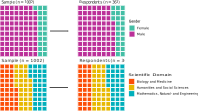
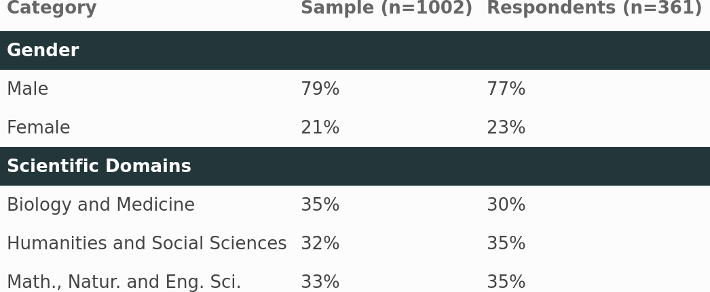
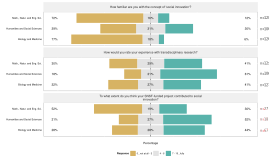
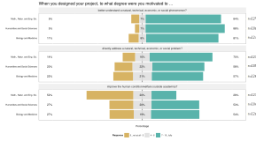
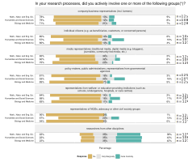
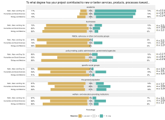

<style>

.center2 {
  margin: 0;
  position: absolute;
  top: 50%;
  left: 50%;
  -ms-transform: translate(-50%, -50%);
  transform: translate(-50%, -50%);
}

.large { font-size: 130% }
.small { font-size: 70% }

.remark-slide-content.hljs-default {
  border-top: 60px solid #23373B;
}

.remark-slide-content > h1 {
  font-size: 30px;
  margin-top: -75px;
}

</style>


```{r xaringan-themer, include=FALSE, warning=FALSE}
##library(xaringanthemer)
##style_mono_accent(
##  base_color = "#1c5253",
##  header_font_google = google_font("Josefin Sans"),
##  text_font_google   = google_font("Montserrat", "300", "300i"),
##  code_font_google   = google_font("Fira Mono")
##)

```


```{r setup, include = FALSE}
library(tufte)
# invalidate cache when the tufte version changes
knitr::opts_chunk$set(
	message = FALSE,
	warning = FALSE,
	cache.extra = packageVersion("tufte")
)
options(htmltools.dir.version = FALSE)
library(dplyr)
library(plyr)
library(ggplot2)
library(ggbeeswarm)
library(plotly)
library(magrittr)
library(ggplot2)
library(PerformanceAnalytics)
library(psych)
library(corrplot)
library(nFactors)
library(kableExtra)
require(ggiraph)
require(ggiraphExtra)
require(plyr)
library(sjPlot)
library(sjmisc)
library(sjlabelled)
library(tidyverse)
library(gt)
library(grid)
library(ggpubr)
library(psych)
library(GPArotation)
library(car)
library(candisc)
library(jtools)
library(formattable)
# Activate likert and plyr
library(likert)
library(plyr)
library(ggcorrplot)
library(waffle)
library(hrbrthemes)
library(tidyverse)
library(scales)
library(waffle)
library(magrittr)
library(hrbrthemes)
library(ggplot2)
library(dplyr)

setwd("./..")
# Data Frame
source("./02_analysis/02_static_responses.R")
# colnames of the specific question groups
source("./02_analysis/99_question_groups.R")
# A good table to display factor analysis
source("https://raw.githubusercontent.com/franciscowilhelm/r-collection/master/fa_table.R")

den <- read.csv("./01_data/sample_meta.csv")

domain_colors <- c("#FC4E07", "#E7B800", "#00AFBB")
knitr::opts_chunk$set(fig.retina=2, echo=FALSE, dev='svg')

data$domain[data$domain == unique(data$domain)[1]] <- "Math., Natur. and Eng. Sci."

g_tick_size_main <- 14
g_tick_size_side <- 12
```


```{r, echo=FALSE, fig.width=16, fig.retina=2, include=FALSE}
dom_dist <- as.data.frame(tibble(
  domains = factor(rep(den$X.1[3:5], 2) ),
  percentages = c(den$Sample..1002.[3:5], den$Respondents..361.[3:5]),
  fct = c(rep("Sample (n = 1002)", 3), rep("Restpondents (n = 361)", 3))
)) 


## dom_waffle <- ggplot(dom_dist, aes(fill=domains, values=percentages*100)) +
##   geom_waffle(color = "white", size=1.125, n_rows = 10, n_cols=10) +
##   facet_wrap(~fct, ncol=2) +
##   scale_x_discrete(expand=c(0,0)) +
##   scale_y_discrete(expand=c(0,0)) +
##   scale_fill_manual(values = c("#FC4E07", "#E7B800", "#00AFBB")) + 
##   labs(fill = "Sci. Domain") +
##   
##   #ggthemes::scale_fill_tableau(name=NULL, direction = -1) +
##   coord_equal() +
##   labs(
##     title = ""
##   ) +
##   theme_ipsum_rc(grid="") +
##   theme_enhance_waffle() 
## dom_waffle
## 
## ggsave(file="dom_waffle.svg", plot=dom_waffle, scale=0.5, dpi=900)
```


```{r pressure, echo=FALSE, fig.cap="A caption", out.width = '50%', include=FALSE}

```


```{r, echo=FALSE, fig.width=16, include=FALSE}
den
gen_dist <- tibble(
  gender = factor(rep(den$X.1[1:2], 2) ),
  percentages = c(den$Sample..1002.[1:2], den$Respondents..361.[1:2]),
  fct = c(rep("Sample (n = 1002)", 2), rep("Restpondents (n = 361)", 2))
) 


## gen_waffle <- ggplot(gen_dist, aes(fill=gender, values=percentages*100)) +
##   geom_waffle(color = "white", size=1.125, n_rows = 10, n_cols=10) +
##   facet_wrap(~fct, ncol=2) +
##   scale_x_discrete(expand=c(0,0)) +
##   scale_y_discrete(expand=c(0,0)) +
##   scale_fill_manual(values=c("#43bea5", "#BB3099")) +
##   coord_equal() +
##   labs(
##     title = "",
##     fill = "Gender"
##   ) +
##   
##   theme_ipsum_rc(grid="") +
##   theme_enhance_waffle()
## 
## gen_waffle
## ggsave(file="gen_waffle.svg", plot=gen_waffle, scale=0.5, dpi=900)

```


```{r echo=FALSE, include=FALSE}

dene <- den[, 2:4]
dene$Sample..1002. <- label_percent(accuracy = 1)(dene$Sample..1002.) 
dene$Respondents..361. <- label_percent(accuracy = 1)(dene$Respondents..361.) 
colnames(dene) <- c("Category", "Sample (n=1002)", "Respondents (n=361)") 
#den[[1]] <- inMinipage(den[[1]], "2.5cm")
dene$Category[dene$Category == unique(dene$Category)[5] ] <- "Math., Natur. and Eng. Sci."


dene_tbl <- kbl(dene) %>%
  kable_paper("striped", full_width = F) %>%
  pack_rows("Gender", 1, 3, label_row_css = "background-color: #23373B; color: #fff;", indent = FALSE) %>%
  pack_rows("Scientific Domains", 3, 5, label_row_css = "background-color: #23373B; color: #fff;", indent = FALSE)
dene_tbl

dene_tbl %>% as_image(height = 20)
save_kable(dene_tbl,file = "table_2.png",
             zoom = 2)
```


```{r sampleRespondent, echo=FALSE, fig.cap="A caption", out.width = '50%', include=FALSE}

```


# Sample, Respondents & Bias

.pull-left[
```{r , echo=FALSE, out.width = '100%', dev='svg'}

```


<br>
<br>
    
* Slight bias towards female participants
* Slight bias towards SSH and Natural Sciences
]


.pull-right[
```{r , echo=FALSE, out.width = '200%'}

```
]

---

# Familiarity with SI and Transdisciplinarity

.right[.small[N={352, 112, 360}]]
<br>

```{r echo=FALSE, fig.align='center', fig.height=4, fig.retina=2, fig.width=12, message=FALSE, warning=FALSE, dev='svg', include=TRUE}

a1b1c2 <- as.data.frame(cbind(
  data[, a1.colnames],
  data$familiarWithSI.response.,
  data$contribToSI.rate.
))

names(a1b1c2) <- c(
  V1 = "Experience with transdisciplinary research",
  V2 = "Familiarity with the concept of 'social innovation'",
  V3 = "Project's contribution to social innovation"
)

#likert_recode(a1b1c2)
items_likert <- 
  #round(d1.df) %>%
  a1b1c2 %>%
  mutate_all(likert_recode) %>%
  #likert(grouping=data$domain)
  likert()

likert_plot(items_likert, h=FALSE, c=c(1,3,5)) + theme( axis.text.y = element_text( 
                         size=g_tick_size_main), axis.text.x = element_text(
                         size=g_tick_size_side), axis.title=element_text(size=g_tick_size_side), legend.text=element_text(size=g_tick_size_side)) 
  #scale_fill_discrete(name = "")
#c("#CA0020", "#F4A582", "#DFDFDF", "#92C5DE", "#92C5DE")

```

<br>


* *Experience with transdisciplinary research* and *project's contribution to SI* have relatively similar distributions, over 45 % of respondents rated equal or higher than 7 for each.
* *Familiarity with SI* generally assessed lower, i.e. over 60 % of respondents rated between 0 and 3.


```{r, include=FALSE}

save_plot("famSI_likert2.svg", likert_plot(items_likert, h=FALSE) , width = 28, height = 16) + font_size(axis_title.x = 30)
```


```{r , echo=FALSE, out.width="75%", fig.align='center', include=FALSE}

```

---
# *Familiarity with SI* across scientific domains

<br>

```{r echo=FALSE, fig.width=12, fig.height=4, dev='svg', fig.retina=2, fig.align='center'}
b1domain.df <-data.frame(familiarWithSI = data$familiarWithSI.response.,
                         domain =  data$domain)

b1domain.df$familiarWithSI <- as.numeric(b1domain.df$familiarWithSI)
b1domain.df %>% 
  gather(key="domain", value="familiarWithSI") %>%
  ggplot( aes(x=familiarWithSI, y=domain, fill=domain),  show.legend = FALSE) +
    geom_boxplot() +
  ylab(" ")+
  theme_light() + 
  theme(axis.text.y=element_blank())+ scale_fill_discrete(name = "Domain") + xlab("Familiarity with SI") + scale_fill_manual(values=c("#FC4E07", "#E7B800", "#00AFBB"), name="Domain") + 
  scale_x_continuous(breaks = seq(0,10,2))  

```
<br>
<br>

* *Familiarity with SI* differs across scientific domains (ANOVA test: p &lt; 0.05)
* *Biology and Medicine* and *Math., Natur, and Eng. Sci.* are similar (pairwise t-test: p &gt; 0.05)
* *Humanities and Social Sciences* are significantly different than the others (pairwise t-test with each: p &lt; 0.05)


---

# Intention &amp; Agency: Motivation

.right[.small[N = {360, 354, 365}]]


<br>

```{r echo=FALSE, fig.width=16, fig.height=4 , fig.align='center', dev='CairoSVG'}


d1.df_named <- d1.df
names(d1.df_named) <- c(
  motivation.pheno. = "better understand a natural, technical, economic, or social phenomenon?",
  motivation.prob. = "directly address a natural, technical, economic, or social problem?",
  motivation.welfare. = "improve the human condition/welfare (outside academia)?"

)
d1_items_likert <- 
  #round(d1.df) %>%
  d1.df_named %>%
  mutate_all(likert_recode) %>%
  likert()

mot_likert <- likert_plot(d1_items_likert, h=FALSE, c=c(1,3,5)) + ggtitle("When you designed your project, to what degree were you motivated to …")
mot_likert + theme( axis.text.y = element_text( 
                         size=g_tick_size_side), axis.text.x = element_text(
                         size=g_tick_size_side), axis.title=element_text(size=g_tick_size_side), legend.text=element_text(size=g_tick_size_side)) 
```

<br>

* Most projects (84 %) driven by academic motivation (better understanding a phenomenon),
* followed by 62 % strongly motivated to directly address a problem;
* *Improving the human condition/welfare* more balanced across answer options


```{r , echo=FALSE, out.width="75%", fig.align='center', include=FALSE}

```


```{r include=FALSE}
# * Relatively consistent results between different sci. domains., slightly lower percentage of motivation to impove human condition among Mathematics, Natural & Engineering Sciences.

save_plot("mot_likert.svg", mot_likert , width = 28, height = 16) + font_size(axis_title.x = 30)
```

---

# Intention &amp; Agency &ndash; Impulses from the Non-academic World

.pull-left[
###### *Addressing a specific problem* ... 

```{r echo=FALSE, fig.height=5}
d3.df_colsum <- as.data.frame(colSums(d3.df))
rownames(d3.df_colsum) <- c("societal",
"economic",
"ecological/natural",
"medical/health",
"technical")

g <- ggplot(d3.df_colsum, aes(x=rownames(d3.df_colsum), y=`colSums(d3.df)`))
# Number of cars in each class:
g + geom_col(fill="#338BBE") + 
  theme_light() + theme(axis.text.x = element_text()) + 
  scale_x_discrete("") + 
  scale_y_continuous("count") + geom_text(aes(label=`colSums(d3.df)`), vjust=1.6, color="white", size=5) + theme( axis.text.y = element_text( 
                         size=g_tick_size_side), axis.text.x = element_text(
                         size=g_tick_size_side), axis.title=element_text(size=g_tick_size_side), legend.text=element_text(size=g_tick_size_side)) 
```

]

.pull-right[

###### Direct benefit for the general population or a specific non-academic group
```{r, echo=FALSE, fig.height=5}
data$benefitForNonAcademy[is.na(data$benefitForNonAcademy)] <- 0 
data$benefitForNonAcademy <- factor(data$benefitForNonAcademy, exclude=NA)

benef <- as.data.frame(table(data$benefitForNonAcademy))
benef$Var1 <- c( "No", "To a minor extent", "To a major extent")

g <- ggplot(benef, aes(x=Var1, y=Freq))
# Number of cars in each class:

g + 
  geom_col(fill="#D32F49") + 
  theme_light() +
   theme( axis.text.y = element_text( 
                         size=g_tick_size_side), axis.text.x = element_text(
                         size=g_tick_size_side), axis.title=element_text(size=g_tick_size_side), legend.text=element_text(size=g_tick_size_side)) + geom_text(aes(label=Freq), vjust=1.6, color="white", size=5) +
scale_x_discrete("") + 
  scale_y_continuous("count") 
  
```


]


* *Medical/health* problems followed by *societal* ones are most often mentioned *impulses from the non-acadmic world*
* *Economic* problems least frequently mentioned category (only 29 participants) 

---
# Transdisciplinary Aspects: Inter-/Transdisciplinary Involvement

.right[.small[N = 360]]

```{r fig.width=16, fig.height=5, fig.align = 'center',echo=FALSE, dev='svg'}

e1.df_named <- e1.df 
names(e1.df_named) <- c(
  groupsInvolved.res. = "researchers from other disciplines",
groupsInvolved.busi.   = "company/business representatives (incl. farmers)",
groupsInvolved.civsoc.= "representatives of NGOs, advocacy or other civil society groups",
groupsInvolved.policy.= "policy makers, public administrations, representatives from governmental agencies",
groupsInvolved.citiz.= "individual citizens (e.g. as beneficiaries, customers, or concerned persons)",
groupsInvolved.media.= "media representatives (traditional media, digital media (e.g. bloggers), journalists, community-led media, etc.)",
groupsInvolved.welfare.= "representatives from welfare- or education-providing institutions (such as schools, kindergartens, hospitals, or care centres)"
)

e1_items_likert <- 
  #round(d1.df) %>%
  e1.df_named %>%
  mutate_all(likert_recode2) %>%
  likert()


trans_likert <- likert_plot(e1_items_likert, h=FALSE, c=c(1,3,5)) + ggtitle("In your research processes, did you actively involve one or more of the following groups?") + theme(axis.text=element_text(size=13))
trans_likert + theme( axis.text.y = element_text( 
                         size=g_tick_size_side), axis.text.x = element_text(
                         size=g_tick_size_side), axis.title=element_text(size=g_tick_size_side), legend.text=element_text(size=g_tick_size_side)) 
```


```{r , echo=FALSE, out.width="60%", fig.align='center', include=FALSE}

```

* Interdisciplinary involvement common: researchers from other disciplines quite centrally involved (41 %)
* Transdisciplinary involvement
  + not as central but noteworthy for fundamental research projects
  + similar across different groups in terms of extent and depth of involvement (*marginal* / *central*)


```{r}

#save_plot("trans_likert.svg", trans_likert , width = 22, height = 20) + font_size(axis_title.x = 40)
```


---

# Transdisciplinary Aspects: Nature of Involvement

.right[.small[N={74, 80, 82, 51, 94, 114}]]


```{r fig.width=16, fig.height=5, echo=FALSE, dev='svg', fig.align='center'}

e2.df_named <- e2.df 
names(e2.df_named) <- c(
  natureOfInvolvement.res. = "researchers from other disciplines",
natureOfInvolvement.busi.   = "company/business representatives (incl. farmers)",
natureOfInvolvement.civsoc.= "representatives of NGOs, advocacy or other civil society groups",
natureOfInvolvement.policy.= "policy makers, public administrations, representatives from governmental agencies",
natureOfInvolvement.citiz.= "individual citizens (e.g. as beneficiaries, customers, or concerned persons)",
natureOfInvolvement.media.= "media representatives (traditional media, digital media (e.g. bloggers), journalists, community-led media, etc.)",
natureOfInvolvement.welfare.= "representatives from welfare- or education-providing institutions (such as schools, kindergartens, hospitals, or care centres)"
)

e2.df_named <- e2.df_named[, 2: ncol(e2.df_named)]


e2_items_likert <- 
  #round(d1.df) %>%
  e2.df_named %>%
  mutate_all(likert_recode4) %>%
  likert()


nature_likert <- likert_plot(e2_items_likert, h=FALSE, c = c(2:5)) + ggtitle("What was the nature of involvement of those groups?") + theme(axis.text=element_text(size=13))
nature_likert+ theme( axis.text.y = element_text( 
                         size=g_tick_size_side), axis.text.x = element_text(
                         size=g_tick_size_side), axis.title=element_text(size=g_tick_size_side), legend.text=element_text(size=g_tick_size_side)) 

```


* Transdisciplinary involvement mostly *consultative* or *contributory* in nature.
* *Collaborative* processes more likely in projects where *welfare-/education providing institutions* or *company/ business representatives* are relevant


---

# Transdisciplinary Aspects: Target Group Goals

##### *Your project has..*

```{r  echo=FALSE, fig.retina=2, fig.width=16, fig.height=4, dev='svg'}
library(data.table)

den_df <- as.data.frame(sapply(FUN=table, e3.df))

denden_df <- transpose(as.data.frame(sapply(FUN=table, e3.df)))
denden_df$Statement <- colnames(den_df) 

dene_df <- as.data.frame(cbind( c(denden_df$V1, denden_df$V2), c(denden_df$Statement, denden_df$Statement), c(rep("True", length(denden_df$Statement)), rep("False", length(denden_df$Statement)))))

dene_df$V1 <-  as.numeric(dene_df$V1)

ggplot(dene_df, aes(fill=V3, y=V1, x=V2)) + 
  geom_bar(position="stack", stat="identity" ) + coord_flip() + theme_light() +
  scale_x_discrete("", labels = c( 
   "targeted a group of people with specific social needs.",
   "included socially disadvantaged or marginalised people.",
	  "worked towards improving people’s lives.",
	  "aimed at empowering people.",
	  "enabled diversity and exchange of different perspectives.") ) +
  scale_y_continuous("Count")+
  theme(text = element_text(size=13)) +  scale_fill_manual(values = c("#D32F49", "#338BBE"), name = "") + theme( axis.text.y = element_text( 
                         size=g_tick_size_side), axis.text.x = element_text(
                         size=g_tick_size_side), axis.title=element_text(size=g_tick_size_side), legend.text=element_text(size=g_tick_size_side)) +
  geom_text(aes(label=V1),size = 5, position = position_stack(vjust = 0.5), color="white")


```

* *Empowering people* most frequently selected (170) category among goals for target group
* *Enabling diversity and exchange of different perspectives* second most freqeuntly selected (151)
* *Worked towards improving people lives* least selected category (167)

---

# Regulatory Framework: Open Science Concepts

###### Norms, requirements, practices applicable to research projects


```{r fig.width=16, fig.height=4 ,echo=FALSE, fig.retina=2, dev='svg'}
library(data.table)

f1_df <- as.data.frame(sapply(FUN=table, f1.df))

f1den_df <- transpose(as.data.frame(sapply(FUN=table, f1.df)))
f1den_df$concepts <- colnames(f1_df) 

f1dene_df <- as.data.frame(cbind( c(f1den_df$V2,f1den_df$V1), c(f1den_df$concepts, f1den_df$concepts), c(rep("Yes", length(f1den_df$concepts)), rep("No", length(f1den_df$concepts)))))

f1dene_df$V1 <- as.numeric(f1dene_df$V1)
ggplot(f1dene_df, aes(fill=V3, y=V1, x=V2)) + 
    geom_bar(position="stack", stat="identity") + coord_flip() + theme_light()  +
  scale_x_discrete("", labels = c( 
	 concepts.pub. =  "open access (publications)", 
   concepts.data. = "open access (research data)",
   	concepts.code. = "open source (code)",
   concepts.infra.="open/shared infrastructure",
	  concepts.review.= "open peer review "
	 ) ) +
  scale_y_continuous("count")+
  theme(text = element_text(size=13)) +  scale_fill_manual(values = c("#D32F49", "#338BBE"), name = "") + theme( axis.text.y = element_text( 
                         size=g_tick_size_side), axis.text.x = element_text(
                         size=g_tick_size_side), axis.title=element_text(size=g_tick_size_side), legend.text=element_text(size=g_tick_size_side)) +
  geom_text(aes(label=V1),size = 5, position = position_stack(vjust = 0.5), color="white")

  

```
* *Open access to publications* most frequently selected category (326 times),
* followed by *open access to data* (234 times)

---

# Regulatory Framework: Gender Dimension & Support for Policy-Making


.pull-left[

###### Explicit consideration of gender in research

```{r echo=FALSE, fig.height=5}
f2.df <- as.data.frame(table(data$concepts2))
f2.df <- f2.df[2:3,]
g <- ggplot(f2.df, aes(x=Var1, y=Freq))
# Number of cars in each class:
g + geom_col(fill="#D32F49")+
  scale_x_discrete("", labels = c("No", "Yes")) +
  scale_y_continuous("count") + 
  theme_minimal()+ geom_text(aes(label=Freq), vjust=1.6, color="white", size=5) + theme( axis.text.y = element_text( 
                         size=g_tick_size_side), axis.text.x = element_text(
                         size=g_tick_size_side), axis.title=element_text(size=g_tick_size_side), legend.text=element_text(size=g_tick_size_side)) 
```
* Vast majority of participants (275) stated *gender* was no explicit consideration in their project

]

.pull-right[

###### Aim: support of evidence-based policy-making
```{r echo=FALSE, fig.height=5}
f3.df <- as.data.frame(table(data$concepts3))
f3.df <- f3.df[2:3,]
g <- ggplot(f3.df, aes(x=Var1, y=Freq))
# Number of cars in each class:
g + geom_col(fill= "#338BBE") +
  scale_x_discrete("", labels = c("No", "Yes")) +
  scale_y_continuous("count") + 
  theme_minimal()+ geom_text(aes(label=Freq), vjust=1.6, color="white", size=5) + theme( axis.text.y = element_text( 
                         size=g_tick_size_side), axis.text.x = element_text(
                         size=g_tick_size_side), axis.title=element_text(size=g_tick_size_side), legend.text=element_text(size=g_tick_size_side)) 
```
* ~ a third of projects aimed at supporting evidence-based policy-making

]


---
# Outcome-orientation: Direct Contribution

.right[.small[N = 360]]

```{r echo=FALSE, fig.width=12, fig.height=6 , fig.retina=2, dev='svg'}
g1.df_named <- g1.df
names(g1.df_named) <- 
  c(
    impactTargetGroup.pub. = "the general population",
    impactTargetGroup.busi.= "businesses",
    impactTargetGroup.socgr. = "specific social groups",
    impactTargetGroup.welfare. = "welfare- and education-providing institutions",
    impactTargetGroup.civsoc. = "NGOs, advocacy or other civil society groups",
    impactTargetGroup.policy. = "policy-making, public administration, governmental agencies",
    impactTargetGroup.acad. = "academia"
  )
g1.df_named <- g1.df_named[, 1:(ncol(g1.df_named)-1)]


g1_items_likert <- 
  #round(d1.df) %>%
  g1.df_named %>%
  mutate_all(likert_recode) %>%
  likert()

outcome_likert <- likert_plot(g1_items_likert, h=FALSE, c=c(1,3,5)) + ggtitle("To what degree has your project contributed to new or better services, products, processes toward...") 

outcome_likert+ theme(axis.text=element_text(size=13)) + theme( axis.text.y = element_text( 
                         size=g_tick_size_side), axis.text.x = element_text(
                         size=g_tick_size_side), axis.title=element_text(size=g_tick_size_side), legend.text=element_text(size=g_tick_size_side)) 
```

```{r echo=FALSE}

#save_plot("outcome_likert.svg", outcome_likert , width = 26, height = 20) + font_size(axis_title.x = 40)
```


```{r , echo=FALSE, out.width="65%", fig.align='center', include=FALSE}

```

* A tiny minority directly contributed to *new or better services, products, or processes* for civil society organisations
* However, 18 % of respondents stated to have strongly contributed to benefit the general population

---

# Outcome-orientation: Intended Effects

###### Intended short- or long-term change benefiting specific target groups or the general population:

```{r echo=FALSE, fig.retina=2, dev = 'svg', fig.align='center', fig.height=5, fig.width=12}

den_df <- as.data.frame(sapply(FUN=table, g2.df[, 1:ncol(g2.df)-1]))
rownames(den_df)[1] <- "NA"
den_df <- den_df[c(2:4,6), ]

den2_df <- transpose(den_df)
den2_df$change <- colnames(den_df)

## denden_df <- transpose(as.data.frame(sapply(FUN=table, den_df)))
## 
## denden_df$change <- colnames(den_df) 
## #colnames(denden_df) <- rownames(den_df) 
den3_df <- as.data.frame(cbind(
  Count = c(den2_df$V1, den2_df$V2, den2_df$V3, den2_df$V4), 
  target_group = rep(den2_df$change, 4),
  change = rep(rownames(den_df),  each=7)
))

den3_df$Count <- as.numeric(den3_df$Count)
##dene_df <- as.data.frame(cbind( c(denden_df$V1 , denden_df$V2, denden_df$V3, denden_df$V4, denden_df$V5, denden_df$V6), c(denden_df$change, denden_df$change, denden_df$change, denden_df$change, denden_df$change, denden_df$change), rep(rownames(den_df), length(denden_df$change), each=TRUE)))
##dene_df$V1 <- as.numeric(dene_df$V1)
den3_df <- den3_df[!den3_df$target_group == "kindOfChange.acad.",]
rownames(den3_df) <- 1:nrow(den3_df)
den3_df <- den3_df[c(19:24, 7:12, 1:6, 13:18) ,]
den3_df$change <- factor(den3_df$change, levels = c("beh", "att", "awar", "und" ))

ggplot(den3_df, aes(fill=change, y=Count, x=target_group)) + 
    geom_bar(position="stack", stat="identity") + coord_flip() + theme_minimal() +
  scale_x_discrete("", labels = c( 
    kindOfChange.pub.			= "the general population",
	  kindOfChange.busi.		=	"businesses",
	  kindOfChange.socgr.		= "specific social groups",
	  kindOfChange.welfare.	=	"welfare, education inst.",	
    kindOfChange.civsoc.	=	"NGOs, civil soc. groups",	
	  kindOfChange.policy.	=	"policy-making, public admin."
	  #kindOfChange.acad.	  = "academia"
	 
	 )) +
theme( axis.text.y = element_text( 
                         size=g_tick_size_main),
axis.text.x = element_text(
                         size=g_tick_size_side),
legend.text=element_text(size=g_tick_size_side))  +
 scale_fill_manual(labels=c( "behaviour", "attitude", "awareness", "understanding"), values = c("#43bea5", "#E7B800", "#00AFBB","#FC4E07" )) +  
  geom_text(aes(label=Count),size = 5, position = position_stack(vjust = 0.5), color="white")

```

* Improving the *understanding* in the general population as well as raising the *awareness* by far the most frequently selected category (79 and 50 times)
* *Changing behaviour* most frequently stated for policy-makers/public administrators

---

# Outcome-orientation: Uptake by Decision-Makers

.pull-left[
###### *To what extent were project results taken up by policy-making and/or public administration and/or governmental agencies?*

```{r echo=FALSE, fig.height=4}
g4.df <- as.data.frame(g4.df
)

g4_freq.df <-  g4.df %>%
  mutate_all(likert_recode) %>%
  table() %>%
  as.data.frame()

## g4_items_likert <- 
##   #round(d1.df) %>%
##   g4.df %>%
##   mutate_all(likert_recode) %>%
##   likert(grouping = data$domain)
##  
## likert_plot(g4_items_likert, h=FALSE)

g <- ggplot(g4_freq.df, aes(x=., y=Freq))
# Number of cars in each class:
g + geom_col(fill="#338BBE")+
  #scale_x_discrete("", labels = c("No", "Yes")) +
  scale_y_continuous("count") + 
  theme_minimal()+ geom_text(aes(label=Freq), vjust=1.6, color="white", size=5) + theme( axis.text.y = element_text( 
                         size=g_tick_size_side), axis.text.x = element_text(
                         size=g_tick_size_side), axis.title=element_text(size=g_tick_size_side), legend.text=element_text(size=g_tick_size_side)) 


```

*  ~ 20 % rated the *uptake of the project results by decision-makers* moderate to high

]


.pull-right[
###### In what way were those results taken up by policy-making and/or public administration and/or governmental agencies?


```{r echo=FALSE, fig.height=4}

g5_freq.df <- g5.df[, 1:ncol(g5.df)-1]
g5_freq.df <- as.data.frame(sapply(FUN=table, g5_freq.df))
g5_freq.df <- g5_freq.df[2,]
g5_freq.df2 <- as.data.frame(transpose(g5_freq.df))
g5_freq.df2$changed <- colnames(g5_freq.df)

g <- ggplot(g5_freq.df2, aes(x=changed, y=V1))
# Number of cars in each class:
g + geom_col(fill="#D32F49")+
  #scale_x_discrete("", labels = c("No", "Yes")) +
  scale_y_continuous("count") + 
  scale_x_discrete("", labels = c("Changed policy (measures)", 
"Changed agenda-setting", 
"Changed regulation or law")) + 
  theme_minimal()+ geom_text(aes(label=V1), vjust=1.6, color="white", size=5) + theme( axis.text.y = element_text( 
                         size=g_tick_size_side), axis.text.x = element_text(
                         size=g_tick_size_side), axis.title=element_text(size=g_tick_size_side), legend.text=element_text(size=g_tick_size_side)) 
 
```

* 9 projects claimed to have influenced *specific laws or regulations*
* 53 projects stated to have changed a *policy or agenda*
]


---

# Outcome-orientation: Impact Statements

.right[.small[N = {328, 302, 286, 290, 273, 272}]]

```{r echo=FALSE, fig.width=16, fig.height=6, fig.retina=2, dev = "svg", fig.align='center'}
g6.df_named <- g6.df
names(g6.df_named) <- 
  c(
    Impactstatements.capab. = "The targeted, non-academic groups have ikely gained capabilities to better tackle similar existing or upcoming issues.",
    Impactstatements.emanc. = "The project’s actions played an emancipatory role for the targeted groups.",
    Impactstatements.understanding. = "The project generated a deeper/better understanding of a specific social issue.",
    Impactstatements.mitig. = "The project contributed to the mitigation of a social issue.",        
    Impactstatements.unknown. = "The project results addressed an issue that was not (widely) known in the society before.",       
    Impactstatements.unaddressed. = "The scrutinised issue was not (widely) addressed in academia before."  
  )

g6_items_likert <- 
  #round(d1.df) %>%
  g6.df_named %>%
  mutate_all(likert_recode) %>%
  likert()

outcome_likert <- likert_plot(g6_items_likert, h=FALSE, c = c(1,3,5)) + ggtitle("To what extent do the following statements apply to your project?") 

outcome_likert + theme( axis.text.y = element_text( 
                         size=g_tick_size_side), axis.text.x = element_text(
                         size=g_tick_size_side), axis.title=element_text(size=g_tick_size_side), legend.text=element_text(size=g_tick_size_side)) 

```


```{r include=FALSE}

```

* Academic dimension most frequently chosen,
* followed by *issues not widely known in society* and *generate a deeper understanding of a specific social issues*.

---

# Dissemination and Exploitation: Dissemination Channels

```{r fig.width=16, fig.height=5 ,echo=FALSE, fig.retina=2, dev='svg'}


h11.df <- h1.df[,1:(ncol(h1.df)-1)]
h12.df <- h11.df[,c(1:2, 4:9, 11)]
h1den_df <- transpose(as.data.frame(sapply(FUN=table, h12.df)))
h1den_df$diss <- colnames(h12.df) 

h1den_df <- h1den_df[, 2:3]
h1den_df$V2 <- as.numeric(h1den_df$V2)
  
g <- ggplot(h1den_df, aes(x=reorder(diss, V2), y=V2))
# Number of cars in each class:
g + geom_col(fill="#D32F49")+
  #scale_x_discrete("", labels = c("No", "Yes")) +
  scale_y_continuous("count") + 
  scale_x_discrete("", labels = c(
    dissChannels.peer.	= "Peer reviewed journal publication",
    dissChannels.mono.	= "Monography, contribution to a book",
  	dissChannels.conf.	= "Conference proceeding",
    dissChannels.policy. = "Policy brief(s)",	
  	dissChannels.trad.	= "Traditional media (TV/radio/print/etc.)",	
  	dissChannels.prof.	= "Professional journals/magazines targeting practitioners",
  	dissChannels.web.		=	"Own institutional or project website/blog",
  	dissChannels.socmed. = "Social media",
    dissChannels.events. = "Targeted events for (non-academic) practitioners",
    dissChannels.platf. = "Online platforms (other than social media channels)"
  )) + 
  theme_minimal()+ geom_text(aes(label=V2), hjust=1.6, color="white", size=5) + theme( axis.text.y = element_text( 
                         size=g_tick_size_side), axis.text.x = element_text(
                         size=g_tick_size_side), axis.title=element_text(size=g_tick_size_side), legend.text=element_text(size=g_tick_size_side)) + coord_flip()
 
```
* Unsurprisingly, the vast majority published in peer-reviewed journals
* Policy briefs were rated lowest but 110 projects stated to have organised events for non-academic practitioners 


---

# Dissemination and Exploitation: Scalability

.right[.small[N = {172, 149, 140}]]

<br>

```{r echo=FALSE, fig.width=16, fig.height=4, fig.retina=2, dev = "svg", fig.align='center'}
h2.df_named <- h2.df
names(h2.df_named) <- c(
scalabilityRating.up. = "Scaling-up (to achieve a higher impact)",
scalabilityRating.out. ="Scaling-out (to different geographic areas)",
scalabilityRating.deep. =  "Scaling-deep (by changing cultural and social values and practices)"
)

h2_items_likert <- 
  #round(d1.df) %>%
  h2.df_named %>%
  mutate_all(likert_recode) %>%
  likert()

outcome_likert <- likert_plot(h2_items_likert, h=FALSE, c = c(1,3,5)) + ggtitle("How would you assess in the long term the scalability of the results generated by your project?") 

outcome_likert + theme( axis.text.y = element_text( 
                         size=g_tick_size_side), axis.text.x = element_text(
                         size=g_tick_size_side), axis.title=element_text(size=g_tick_size_side), legend.text=element_text(size=g_tick_size_side)) 

```

* 69 % of the respondents were confident of the scaling-up potential of the project results


---

# Further steps

<br>

##### Ongoing tasks

* Dimension reduction; factor analysis, PCA ....
* Statistical analysis of relationships between variables, correlation analysis.
* Linear and logistic regression models.

<br>

##### Outlook  


* Build statistical models to predict "degree" of SI
* Compile analytical results of survey into a report (part of the final report)
* Ideally: test with more quantitative data
* Publish results in scientific journal

```{r echo=FALSE}

```
```{r echo=FALSE, include=FALSE}

den_cor <- round(cor(as.data.frame(cbind(g1.df, d1.df)), method = "spearman", use = "pairwise.complete.obs"), 1)

rownames(den_cor) <- c("impactGr.public",          "impactGr.business",         "impactGr.socGroups",        "impactGr.welfareOrg", "impactGr.civSoc",       "impactGr.policy",       "impactGr.academia",         "mot.phenomenon",          "mot.problem",           "mot.welfare" )

colnames(den_cor) <- rownames(den_cor)

corrp.mat <- cor_pmat(as.data.frame(cbind(g1.df, d1.df)))
ggcorrplot( den_cor, 
            hc.order=FALSE, 
            type="lower", 
            lab=TRUE,  
            p.mat = corrp.mat, 
            ggtheme = ggplot2::theme_minimal,
            colors = c("#3C9AB2", "white", "#F22300"),
            insig="blank")


```


---
class:clear

<br>
<br>
<br>

.center[
### Many thanks for your attention! 
]

<br>
<br>
<br>

Contact information:
* Utku Demir <demir@zsi.at>
* Dietmar Lampert <lampert@zsi.at> (presenter)
* Klaus Schuch <schuch@zsi.at>

ZSI - Centre for Social Innovation - https://zsi.at/en

